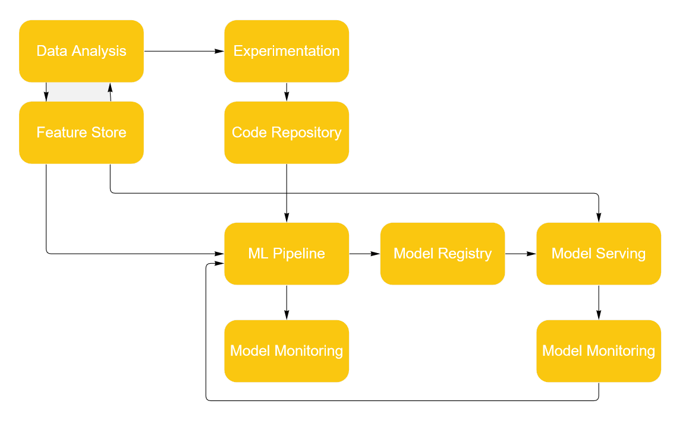

Claro, vou criar um README.md em Markdown explicando o MLOps Toolkit com os itens solicitados.

# MLOps Toolkit

## Descrição

O MLOps Toolkit é uma coleção de ferramentas e tecnologias essenciais para a implementação eficiente de práticas de MLOps (Machine Learning Operations). Ele visa facilitar o gerenciamento e a automação de pipelines de machine learning, desde o desenvolvimento até a produção, garantindo a reproducibilidade, escalabilidade e monitoramento adequado de modelos de machine learning.

| Type of Stack Component | Description                                                   |
|-------------------------|---------------------------------------------------------------|
| Orchestrator            | Orchestrating the runs of your pipeline                       |
| Artifact Store          | Storage for the artifacts created by your pipelines           |
| Container Registry      | Store for your containers                                     |
| Step Operator           | Execution of individual steps in specialized runtime environments |
| Model Deployer          | Services/platforms responsible for online model serving       |
| Feature Store           | Management of your data/features                              |
| Experiment Tracker      | Tracking your ML experiments                                  |
| Alerter                 | Sending alerts through specified channels                      |
| Annotator               | Labeling and annotating data                                  |
| Data Validator          | Data and model validation                                     |
| Image Builder           | Builds container images.                                      |
| Model Registry          | Manage and interact with ML Models                            |

## Componentes Principais

### BentoML

**BentoML** é uma estrutura de código aberto que simplifica o empacotamento de modelos de machine learning e serviços associados em contêineres Docker prontos para produção. Ele permite a criação de APIs RESTful e de artefatos de modelo de forma simples e rápida, garantindo a portabilidade e a facilidade de implantação em diferentes ambientes de produção.

### MLflow

**MLflow** é uma plataforma de código aberto para gerenciamento de ciclo de vida de modelos de machine learning. Ele oferece recursos para rastreamento de experimentos, gerenciamento de versões de modelos, reprodução de resultados e implantação de modelos em várias plataformas, facilitando a colaboração e a escalabilidade em equipes de machine learning.

### Pachyderm

**Pachyderm** é uma plataforma de código aberto para construção de pipelines de dados escaláveis e reprodutíveis. Ele oferece uma abordagem baseada em versionamento para o processamento de dados, permitindo a criação de pipelines de machine learning robustos e confiáveis que podem ser facilmente reproduzidos e escalados para grandes volumes de dados.

### Prefect

**Prefect** é uma estrutura de código aberto para automação de fluxos de trabalho e orquestração de pipelines de dados. Ele fornece uma API Python intuitiva para definir e executar fluxos de trabalho complexos, com suporte integrado para agendamento, monitoramento e tratamento de erros, tornando mais fácil e eficiente o gerenciamento de pipelines de machine learning.

### Seldon

**Seldon** é uma plataforma de implantação de modelos de machine learning em escala, projetada para Kubernetes. Ele oferece recursos para implantar, monitorar e gerenciar modelos de machine learning em produção, com suporte para exploração de modelos, monitoramento de desempenho e atualização contínua, garantindo a disponibilidade e a confiabilidade de sistemas de machine learning em produção.

### ZenML

**ZenML** é uma estrutura de código aberto para gerenciamento de pipelines de machine learning com foco na simplicidade e na escalabilidade. Ele oferece uma abordagem baseada em configuração para definir e executar pipelines de machine learning, com suporte integrado para versionamento de dados e modelos, experimentação automatizada e implantação de modelos em diferentes ambientes, facilitando o desenvolvimento e a operação de sistemas de machine learning em larga escala.

## Como Usar

Para começar a usar o MLOps Toolkit, siga as instruções de instalação e configuração para cada uma das ferramentas incluídas. Consulte a documentação oficial de cada ferramenta para obter mais detalhes sobre como utilizá-las em conjunto para criar e gerenciar pipelines de machine learning de ponta a ponta.

